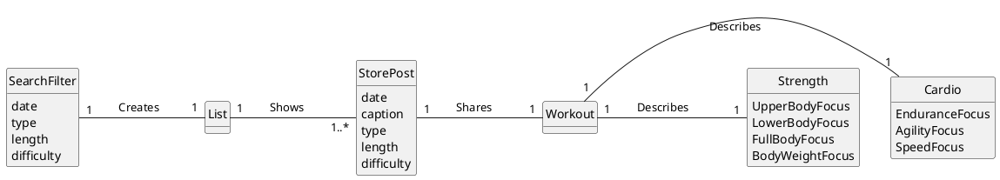
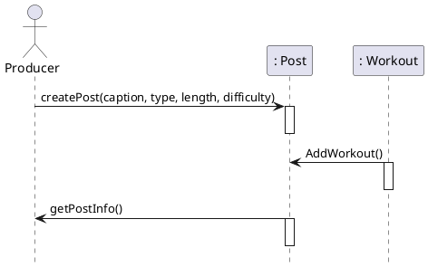
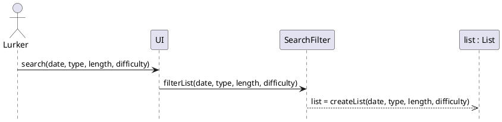
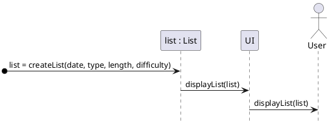
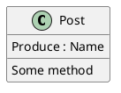

## Domain Model

```plantuml
@startuml
hide circle
hide empty methods
' classes
class StorePost{
date
caption
type
length
difficulty
}
class List{
}

class Cardio{
   EnduranceFocus
   AgilityFocus
   SpeedFocus
}

class Strength{
   UpperBodyFocus
   LowerBodyFocus
   FullBodyFocus
   BodyWeightFocus
}

class SearchFilter{
date
type
length
difficulty
}

' associations
StorePost "1" - "1" Workout : \tShares\t\t
Workout "1" - "1" Cardio : \tDescribes\t\t
Workout "1" - "1" Strength : \tDescribes\t\t
List "1" - "1..*" StorePost : \tShows\t\t
SearchFilter "1" - "1" List : \tCreates\t\t
@enduml
```

# Sequence Diagrams

### Posting a workout:

```plantuml
@startuml
hide footbox
actor Producer as producer
participant ": Post" as Post
participant ": Workout" as workout

producer -> Post : createPost(caption, type, length, difficulty)
activate Post
deactivate Post
workout -> Post : AddWorkout()
activate workout
deactivate workout
producer <- Post : getPostInfo()
activate Post
deactivate Post
@enduml
```

### Searching content

```plantuml 
@startuml
hide footbox
actor Lurker as lurker
participant "UI" as ui
participant "SearchFilter" as search
participant "list : List" as list 

lurker -> ui : search(date, type, length, difficulty) 
ui -> search : filterList(date, type, length, difficulty) 
search -->> list :  list = createList(date, type, length, difficulty)
@enduml
```
### Seeing a list 

```plantuml 
@startuml
hide footbox
participant "list : List" as list 
participant "UI" as ui
actor "User" as user 


[o-> list : list = createList(date, type, length, difficulty) 
list -> ui : displayList(list)
ui -> user : displayList(list)

@enduml
```
 

```plantuml
@startuml
class Post {
Produce : Name
{method} Some method
}
@enduml
```
