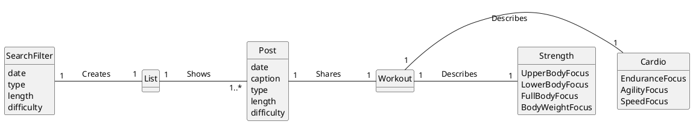

```plantuml
@startuml
hide circle
hide empty methods
' classes
class Post{
date
caption
type
length
difficulty
}
class List{
}

class Cardio{
   EnduranceFocus
   AgilityFocus
   SpeedFocus
}

class Strength{
   UpperBodyFocus
   LowerBodyFocus
   FullBodyFocus
   BodyWeightFocus
}

class SearchFilter{
date
type
length
difficulty
}

' associations
Post "1" - "1" Workout : \tShares\t\t
Workout "1" - "1" Cardio : \tDescribes\t\t
Workout "1" - "1" Strength : \tDescribes\t\t
List "1" - "1..*" Post : \tShows\t\t
SearchFilter "1" - "1" List : \tCreates\t\t
@enduml
```