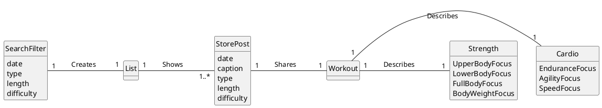
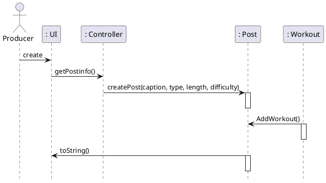
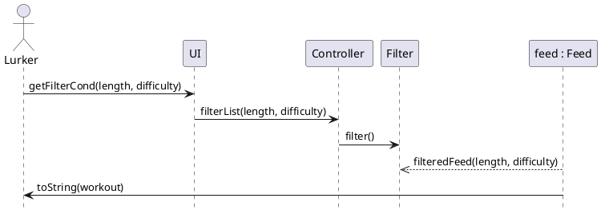
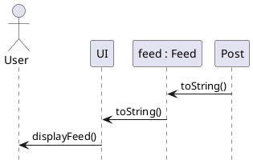
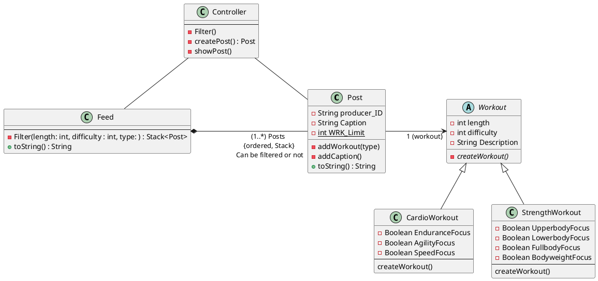

## Domain Model

```plantuml
@startuml
hide circle
hide empty methods
' classes
class StorePost{
date
caption
type
length
difficulty
}
class List{
}

class Cardio{
   EnduranceFocus
   AgilityFocus
   SpeedFocus
}

class Strength{
   UpperBodyFocus
   LowerBodyFocus
   FullBodyFocus
   BodyWeightFocus
}

class SearchFilter{
date
type
length
difficulty
}

' associations
StorePost "1" - "1" Workout : \tShares\t\t
Workout "1" - "1" Cardio : \tDescribes\t\t
Workout "1" - "1" Strength : \tDescribes\t\t
List "1" - "1..*" StorePost : \tShows\t\t
SearchFilter "1" - "1" List : \tCreates\t\t
@enduml
```

# Sequence Diagrams

### Posting a workout:

```plantuml
@startuml
hide footbox
actor Producer as producer
participant ": UI" as ui
participant ": Controller" as controller
participant ": Post" as Post
participant ": Workout" as workout


producer -> ui : create
ui -> controller : getPostinfo()
controller -> Post : createPost(caption, type, length, difficulty)
activate Post
deactivate Post
workout -> Post : AddWorkout()
activate workout
deactivate workout
ui <- Post : toString()
activate Post
deactivate Post
@enduml
```

### Searching content

```plantuml 
@startuml
hide footbox
actor Lurker as lurker
participant "UI" as ui
participant "Controller " as controller
participant "Filter" as filter
participant "feed : Feed" as feed 

lurker -> ui : getFilterCond(length, difficulty) 
ui -> controller : filterList(length, difficulty) 
controller -> filter : filter()
filter <<-- feed : filteredFeed(length, difficulty)
feed -> lurker : toString(workout)
@enduml
```
### Seeing the Feed 

```plantuml 
@startuml
hide footbox
actor "User" as user 
participant "UI" as ui
participant "feed : Feed" as feed

Post -> feed : toString() 
feed -> ui : toString()
ui -> user : displayFeed()

@enduml
```
 

## Class Diagram 

```plantuml
@startuml
'skinparam classAttributeIconSize 0
class Post {
-String producer_ID
-String Caption
-{Static} int WRK_Limit
{method} -addWorkout(type) 
{method} -addCaption()
{method} +toString() : String
}

abstract class Workout {
-int length 
-int difficulty 
-String Description
{method} {abstract} -createWorkout()
}

class CardioWorkout {
-Boolean EnduranceFocus
-Boolean AgilityFocus 
-Boolean SpeedFocus
--
createWorkout() 
}

class StrengthWorkout {
-Boolean UpperbodyFocus
-Boolean LowerbodyFocus 
-Boolean FullbodyFocus
-Boolean BodyweightFocus 
--
createWorkout() 
}

class Feed {
--
-Filter(length: int, difficulty : int, type: ) : Stack<Post> 
+toString() : String
}

class Controller {
--
-Filter() 
-createPost() : Post 
-showPost()
}

Feed *-"(1..*) Posts \n{ordered, Stack}\n Can be filtered or not" Post : \t\t\t\t\t\t\t
Post -> "1 (workout)" Workout : \t\t\t
Workout <|-- CardioWorkout
Workout <|-- StrengthWorkout
Controller -- Post 
Controller -- Feed
@enduml
```
